# **Edward Dougherty and Jordan Benjamin T3A2**

## **SpaceSaver: MERN full-stack app assignment**

---

### Client:

-   Deployed Staging App:
-   Deployed Production:

### Server:

-   Deployed Staging App:
-   Deployed Production:

### Contents

-   [Introduction](#introduction)
-   [Application Description](#application-description)
    -   [Purpose](#purpose)
    -   [Features and Functionality ](#features-and-functionality)
    -   [Target audience](#target-audience)
    -   [Tech stack](#tech-stack)
-   [Data Flow Diagram (DFD)](#data-flow-diagram-dfd)
-   [Application Architecture Diagram (AAD)](#application-architecture-diagram-aad)
-   [User stories](#user-stories)
    -   [Different iterations](#different-iterations)
    -   [Final user stories](#final-user-stories)
-   [Wireframes](#wireframes)
    -   [Flow and navigation](#flow-and-navigation)
    -   [High fidelity wireframes](#high-fidelity-wireframes)
-   [Planning methodology](#planning-methodology)
    -   [Trello screenshots](#trello-screenshots)

---

## Introduction

In Phase A, the focus was on ideation and strategic planning. This encompassed pinpointing a challenge within a local business and formulating a tailored solution to address their needs. The process involved crafting the app's architecture and delineating data flow through comprehensive diagrams, showcasing the structural framework and outlining the information exchange among processes, entities, and data repositories. Additionally, tasks included shaping user personas and crafting corresponding user stories, creating high-fidelity wireframes, and implementing an agile planning approach throughout the developmental stages.

---

## Application Description

Welcome to SpaceSaver, the solution to your space management challenges. Tired of the complexities of juggling multiple platforms for creating, organising, and accessing spaces? Look no further. SpaceSaver simplifies your experience with a user-friendly sign-up/log-in system, allowing effortless creation and joining of spaces. No more hassle in managing user access or navigating through intricate booking processes. With secure authentication options, intuitive room organisation, and straightforward booking management, SpaceSaver is your all-in-one tool for seamless and efficient space utilisation. Experience a new era of simplicity and control in space management – welcome to SpaceSaver, where we've streamlined the solution for you.

[Back to contents](#contents)

---

## Purpose

The purpose of SpaceSaver, is to provide users with a comprehensive solution for efficient space management. The primary objectives include:

1. **Optimising Workspace Utilisation:** SpaceSaver aims to enhance the effective use of physical spaces within businesses or organisations. By allowing users to create and manage designated spaces, the application facilitates streamlined collaboration and resource allocation.
1. **Solving Local Business Challenges:** The app is designed to address specific challenges faced by local businesses. By identifying and solving these challenges, SpaceSaver contributes to the overall improvement of operational efficiency and productivity.
1. **Enhancing User Experience:** Through features like user-friendly sign-up/log-in, intuitive space creation, and robust user access management, SpaceSaver seeks to provide a positive and seamless experience for its users. The goal is to simplify complex processes associated with space management.
1. **Facilitating Booking Processes:** The application streamlines the booking process for spaces and rooms. Users can create, view, update, and delete bookings, promoting a hassle-free and organised approach to scheduling and utilising available spaces.
1. **Empowering Agile Workflows:** With agile planning integrated into the development process, SpaceSaver aims to adapt to changing requirements efficiently. This ensures that the application remains responsive to user needs and evolving business dynamics.

SpaceSaver serves as a versatile tool that goes beyond traditional space management. It provides a holistic solution for businesses seeking to optimise their physical spaces, enhance collaboration, and improve overall operational efficiency. Whether for small teams or large enterprises, SpaceSaver is crafted to redefine the way users interact with and make the most of their workspaces.

[Back to contents](#contents)

---

## Features and Functionality

SpaceSaver aims to meet the Minimum Viable Product of allowing users to login to the application in order for them to either create or join a space where bookings will be made for their desired spot in their respective office space.

This is the core of the application, and the features listed below meets the requirements which provides users with a comprehensive solution for efficient space management.

### Feature 1 (Account system)

Users must have a SpaceSaver account to log-in and gain access to the application. Users will be prompted to sign-up and create an account if they haven't done so.

#### Functionality

##### User Data

User data is required for the rest of application features to work as expected, this is for the sole reason that user data is stored in each user account and other features depends on this user data.

For example, user data is necessary for an admin to know which users are in each space or room for example which provides admins user access management. This data is also especially important in the booking feature of the application, where keeping track which user bookings dictates the behaviour and integrity of the application.

##### Authentication

Authentication comes as an important functionality of this feature with it being internally handled using JWT, involving a straightforward username and password process. The log-in period aligns with the typical workday, spanning 8-12 hours for extra security measure.

#### Nice to have

-   Optional feature for Microsoft, Gmail, Apple SSO, or O-Auth logins.

### Feature 2 (Space management)

SpaceSaver allows for flexible space management where all users are able to create and join a space which allows for different user permissions.

#### Functionality

##### Space creation and sharing

-   All users are able to create a space.
-   The creator of that space is able to share the space ID for other users to access and join.

##### Room creation

Admins have the authority to create, edit and name rooms within that space.

##### Administrative control

-   The creator of a space is automatically designated as the admin. Granting them the ability to edit the space.
-   Admins are also granted user access management, which is a feature in and on itself.

#### Nice to have

-   This flexibility of space management for all users is perfect for this current MVP as mentioned it provides flexibility which allows for progressive scaling. However, in the future a much more robust and defined user access management with clear user role based access control.

### Feature 3 (User access management)

SpaceSaver allows all users access to information of other users within a space whilst an Admin is granted permissions for full control of user access management.

#### Functionality

##### User information and invitation

-   All users have access to view other users in the respective spaces they joined and rooms they're booked in.
-   Non-Admin users are only allowed to invite other users to a room.

##### User management

An Admin is able to add and remove users willingly from a space and room.

##### Admin control

-   Only one admin allowed at a time per space.
-   An admin is able to provide other users their administrative permissions, stripping them off theirs, this triggers a warning when attempting to change roles.

#### Nice to have

-   Notifying users when they have either added or removed from a space.

### Feature 4 (Booking Management)

One of if not SpaceSaver's most important feature in this current MVP implementation, where all users are able to manage bookings of rooms within spaces.

#### Functionality

##### Bookings

Users are able to create, view, update, delete and even invite other users to a booking. This allows users with full individual booking management.

##### Calendar integration

-   A calendar overview displays bookings within a Space, showcasing available rooms.
-   Both users and admins can update/delete bookings for which they are a part of.

#### Nice to have

-   Notification of bookings.

### Feature 5 (Dashboard)

The dashboard serves as the central hub for all users and admins using SpaceSaver, it is the interface of the application itself. Similar functionality and UI will be prevalent for all pages with diferences being in they layout and content itself.

#### Functionality

##### Three main sections

-   A header to display current page and user profile details.
-   A sidebar for easy navigation to different app sections: Home, Booking, Spaces, Rooms, Settings.
-   A main section which comprises the core dashboard content.

-   Sub-sections include the user's name, a smaller calendar for accessing the booking space, a quick view of available rooms, and a quick book feature.

#### Nice to have

-   Optional feature for users to view analytics.

[Back to contents](#contents)

---

## Target audience

SpaceSaver has been developed with a growing businesses in mind, especially those undergoing expansion into larger spaces and facing the challenge of organising and managing bookings without an existing system.

This application is born out of conversations with our clients, understanding their unique needs. Designed to be scalable for larger offices, SpaceSaver offers a tailored solution for businesses, with the foresight to adapt seamlessly as your workspace grows.

SpaceSaver's current focus is of course providing growing enterprises with a robust office space booking and management system at almost no cost. This provides management and administration teams in organisations access to a tool that our competitors provides at a cost.

Both management and employees are able to embrace the simplicity of our user-friendly sign-up/log-in system, intuitive space creation, and hassle-free booking management.

Make a smooth transition into your expanded workspace with SpaceSaver, where simplicity meets scalability, all rooted in our understanding of the specific requirements of Australian businesses. Welcome to a new era of efficiency in space management.

[Back to contents](#contents)

---

## Tech stack

**Front-end**:

-   React.js with React Query, & React Hook Form
-   Tailwind & Material-ui for styling

**Back-end**:

-   Node with ExpressJS

**Database**:

-   MongoDB with Mongoose

**Deployment**:

-   Front-end: Netlify
-   Back-end: Heroku

**Testing**:

-   Jest
-   SuperTest

**Project-management tools**:

-   Trello
-   Discord

**Utilities**:

-   Draw.io
-   Figma

**DevOps**:

-   Git
-   Github
-   VS Code

[Back to contents](#contents)

---

## Data Flow Diagram (DFD)

The SpaceSaver Data Flow Diagram (DFD) intricately illustrates the dynamic flow of information among user entities, database documents (comprising users, spaces, rooms, and bookings), and the various processes involved in the system.

In the initial iteration of the DFD, meticulous attention was given to delineate the interaction nuances between user entities and the associated processes, offering a preliminary understanding of the data flow dynamics.

To delve deeper into the system's intricacies, the second iteration of the DFD was meticulously crafted. This phase placed a heightened emphasis on ensuring a comprehensive representation of data interactions with both the processes and the data store. The aim was to create a more detailed and nuanced visualisation of the intricate relationships and exchanges within the SpaceSaver application.

For a visual representation of these iterations, refer to the following images:

**Version 1**
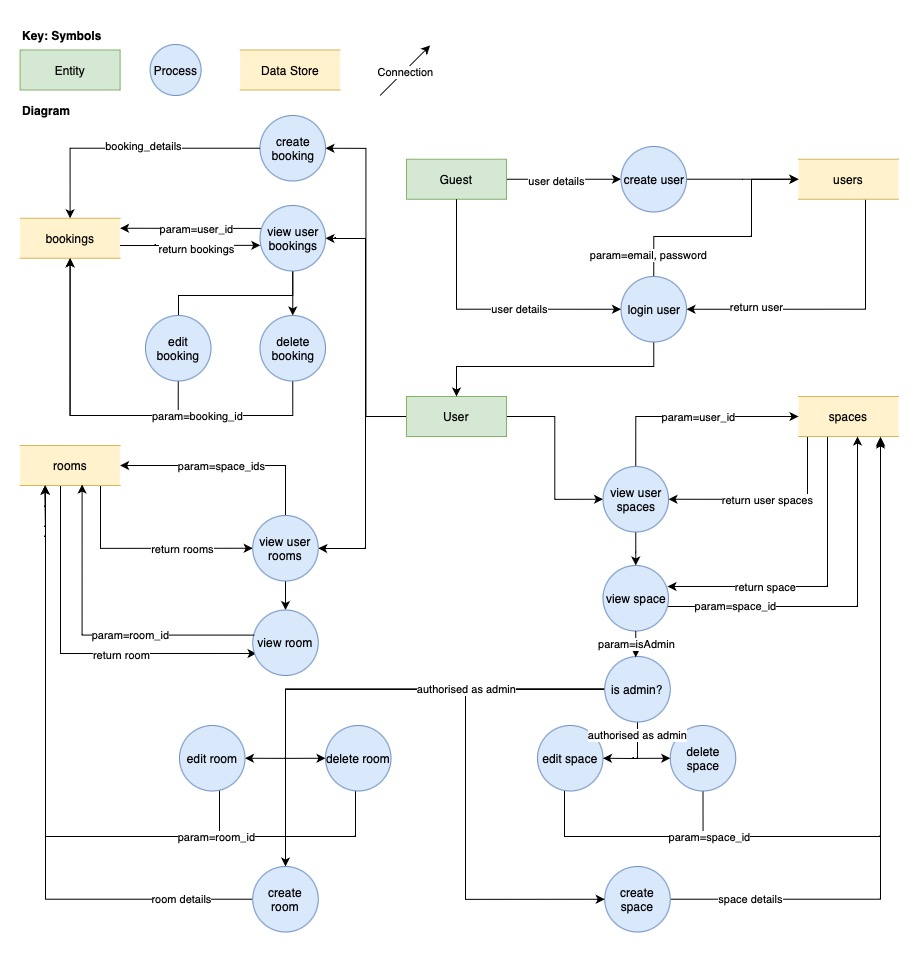

**Version 2**
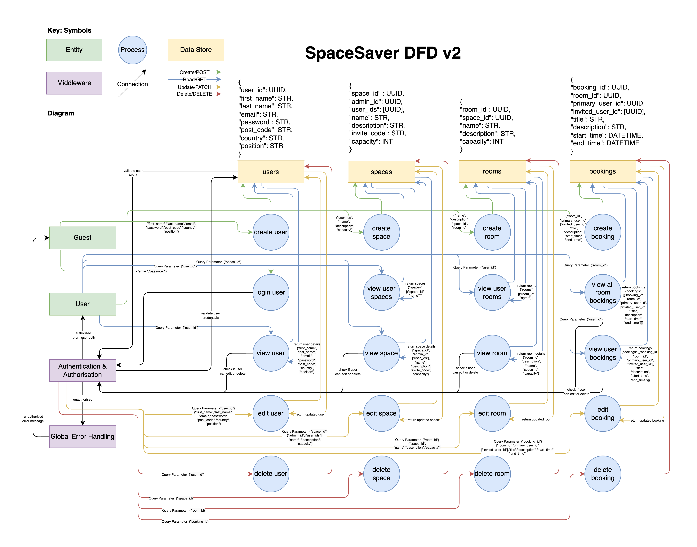

[Back to contents](#contents)

---

## Application Architecture Diagram (AAD)

The SpaceSaver app is structured with three key components: a front-end, back-end, and a database. In our high-level Application Architecture Diagram (AAD), we provide a bird's-eye view of each of these components, offering a broad understanding of how they fit together. On the flip side, the low-level AAD zooms in to dissect the detailed interactions between each component, shedding light on the intricacies of their relationships.

### High Level AAD

### Low Level AAD (Development Framework)

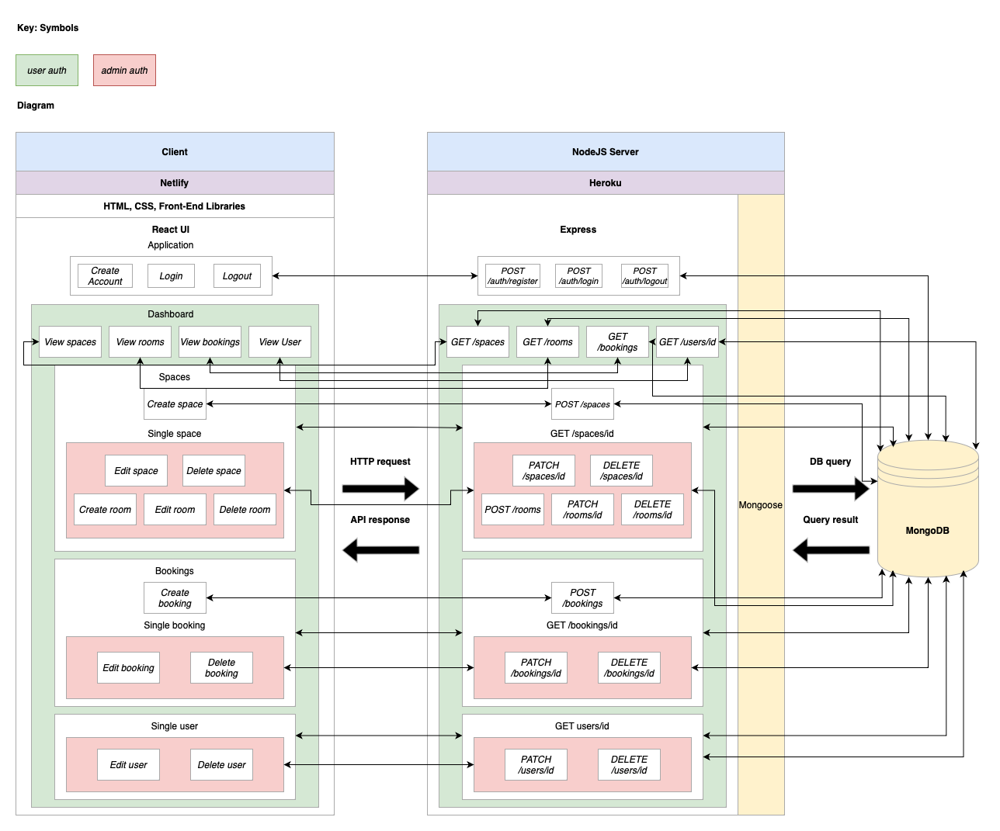

[Back to contents](#contents)

---

## User stories

In the strategic development of the SpaceSpacer application, the selection of these three personas—Robert, the General Manager; Arlette, the Tech Support Specialist; and Robin, the Sales Lead Generator—was driven by a holistic approach to user-centric design. Robert, as the General Manager, embodies the leadership and decision-making perspective, reflecting the overarching goals of efficient office operations, enhanced team dynamics, and data-driven decision-making. His persona guides the development of features tailored to managerial needs, ensuring SpaceSpacer aligns with high-level organisational objectives.

On the other hand, Arlette and Robin represent distinct user segments within the organisation—Arlette as the tech-savvy full-time employee and Robin as the part-time/casual simplicity seeker. By incorporating these personas, we address the diverse needs and preferences existing within our user base, allowing SpaceSpacer to cater to a broad spectrum of users. Arlette's focus on advanced tech features and Robin's emphasis on simplicity provide valuable insights into creating an app that is not only feature-rich but also adaptable and user-friendly for a wide range of user scenarios, promoting inclusivity and usability throughout the organisation.

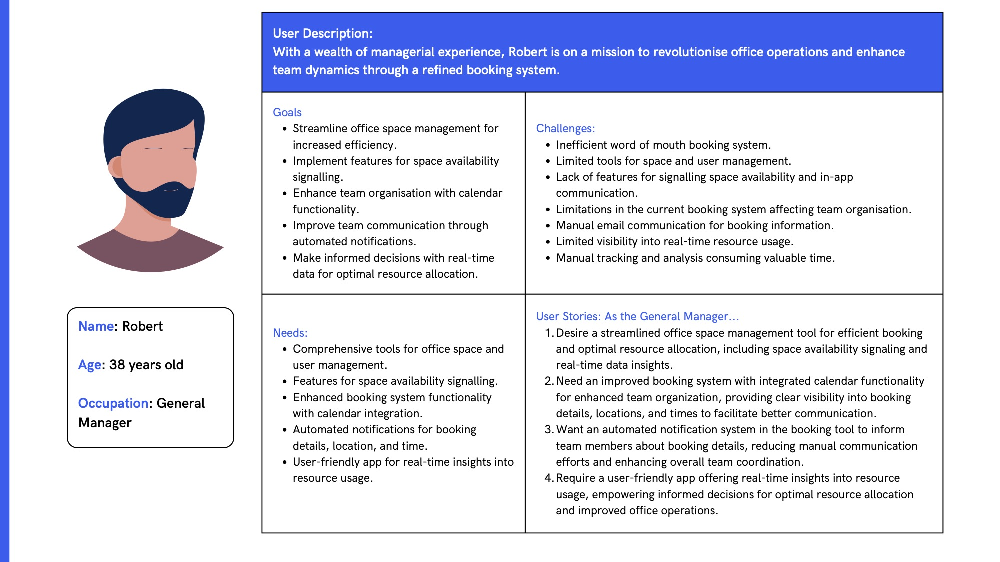

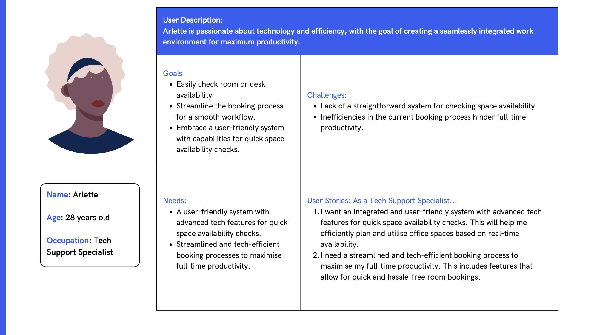

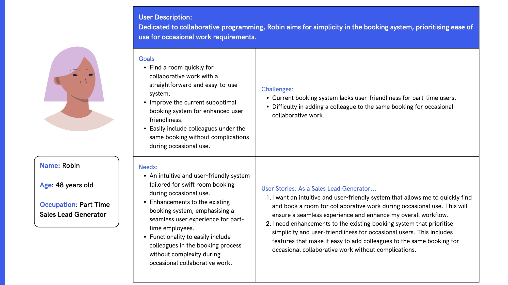

[Back to contents](#contents)

### Different iterations

#### Initial

##### User Story - Persona 1: Jack (26) Technical Support Specialist

As Jack, I want an all-in-one system/app for booking spaces, so I can easily check availability and book a room or desk, making my work environment more streamlined and enhancing productivity.

Acceptance Criteria:

-   The system/app should provide a clear interface for checking room or desk availabilities.
-   Booking a room or desk should be a straightforward process, requiring minimal steps.

Definition of Done:

-   The system/app has been developed and thoroughly tested.
-   User feedback has been considered and incorporated for improving the user interface.

##### User Story - Persona 2: Jill (37) Senior Software Developer

As Jill, I want a user-friendly booking system with emphasis on UX/UI, so I can quickly find a room for collaborative work with my pair programmer.

Acceptance Criteria:

-   The booking system should have an intuitive and visually appealing user interface.
-   Jill should be able to find and book a room within a few clicks.

Definition of Done:

-   The booking system has been developed and tested for user-friendliness.
-   Jill has tested the system and provided feedback, which has been incorporated.
-   Documentation includes guidelines for users.

As Jill, I want the ability to add my pair programmer under the same booking, simplifying the collaboration process.

Acceptance Criteria:

-   The booking system should allow Jill to easily include her pair programmer when making a booking.

Definition of Done:

-   The functionality for adding multiple users under the same booking has been successfully implemented.

##### User Story - Persona 3: Henrietta (29) Marketing Associate

As Henrietta, I want an individual pin-based access for immediate room bookings, allowing me to efficiently book a room if I see it available.

Acceptance Criteria:

-   The system should provide a pin-based access feature for immediate room bookings.
-   Henrietta should be able to check room availability instantly without logging in

Definition of Done:

-   The pin-based access feature is successfully implemented and tested.
-   User testing has been completed, and any necessary adjustments have been made.

Employer/Management User Stories

##### User Story - Persona 4: Emily (41) General Manager

As Emily, I want the ability to manage users and their access to spaces.

Acceptance Criteria:

-   The booking system should provide functionality for user management and access control.
    Definition of Done:
-   User management features are successfully implemented and tested.
-   Emily has provided feedback, and necessary adjustments have been made.
-   Documentation includes instructions for administrators on user management.

As Emily, I want features for space availability signalling and potentially a built-in chat functionality for improved communication.

Acceptance Criteria:

-   The booking system should have features to signal space availability.
-   If a chat functionality is implemented, it should provide seamless in-app communication.
    Definition of Done:
-   Space availability signalling features are successfully integrated and tested.
-   If applicable, the chat functionality is implemented, tested, and user-friendly.
    Documentation includes guidelines for utilising space signalling and chat features.

##### User Story - Persona 5: Aisha (39) Project Manager

As Aisha, I want calendar integration in the current booking system, allowing me to organise my team more efficiently.

Acceptance Criteria:

-   The booking system should be integrated with a calendar, providing real-time information about bookings.
    Definition of Done:
-   Calendar integration is successfully implemented and tested.
-   The system seamlessly syncs with Aisha's calendar for efficient team organisation.
    Documentation includes instructions for utilising the calendar integration.

##### User Story - Persona 6: Muhammad (53) Team Leader

As Muhammad, I want an automated notification system, so my team can receive timely notifications regarding booking information, location, and time.

Acceptance Criteria:

-   The booking system should send automated notifications to team members regarding booking details.
    Definition of Done:
-   The automated notification system is successfully implemented and tested.
-   Notifications are delivered accurately and in a timely manner.
-   Documentation includes guidelines for setting up and managing notification preferences.

##### User Story - Persona 7: Deo (28) Team Coordinator

As Deo, I want a user-friendly app for real-time insights into team resource usage, enabling me to make informed decisions and streamline resource allocation.

Acceptance Criteria:

-   The app should provide a user-friendly interface for accessing real-time insights into team resource usage.
    Definition of Done:
-   The app is successfully developed and tested for user-friendliness.
-   Thorough testing ensures accurate and real-time data representation.
-   Documentation includes guidelines for utilising the app's features.

[Back to contents](#contents)

#### Combined User Stories

Too many personas led to confusion, so they were combined the personas into 3 main types of users we remade the user stories to suit
Manager Persona

User Story 1:
As the General Manager, I want a comprehensive office space management tool that streamlines the booking process, allowing for increased efficiency and optimal resource allocation. This includes features for space availability signalling and real-time data insights.

User Story 2:
As the General Manager, I need an enhanced booking system with calendar functionality to improve team organisation. This will ensure that team members have clear visibility into booking details, locations, and times, facilitating better communication and coordination.

User Story 3:
As the General Manager, I want an automated notification system within the booking tool to inform team members about booking details. This feature will help in reducing manual communication efforts and enhancing overall team communication.

User Story 4:
As the General Manager, I require a user-friendly app that provides real-time insights into resource usage. This will empower me to make informed decisions for optimal resource allocation and improve overall office operations.

Employee Persona 1: Full-time Tech Enthusiast

User Story 1:
As a Tech Support Specialist, I want an integrated and user-friendly system with advanced tech features for quick space availability checks. This will help me efficiently plan and utilise office spaces based on real-time availability.

User Story 2:
As a Tech Support Specialist, I need a streamlined and tech-efficient booking process to maximise my full-time productivity. This includes features that allow for quick and hassle-free room or desk bookings.

[Back to contents](#contents)

#### Final user stories

##### Manager Persona

**User Story 1:**

-   As Robert, the General Manager, I want a comprehensive office space management tool that streamlines the booking process, allowing for increased efficiency and optimal resource allocation. This includes features for space availability signalling and real-time data insights.

**User Story 2:**

-   As Robert, the General Manager, I need an enhanced booking system with calendar functionality to improve team organisation. This will ensure that team members have clear visibility into booking details, locations, and times, facilitating better communication and coordination.

**User Story 3:**

As Robert, the General Manager, I require a user-friendly app that provides real-time insights into resource usage. This will empower me to make informed decisions for optimal resource allocation and improve overall office operations.

##### Employee Persona 1: Full-time Tech Enthusiast

**User Story 1:**

As Arlette, the Tech Support Specialist, I want an integrated and user-friendly system with advanced tech features for quick space availability checks. This will help me efficiently plan and utilise office spaces based on real-time availability.

**User Story 2:**

-   As Arlette, the Tech Support Specialist, I need a streamlined and tech-efficient booking process to maximise my full-time productivity. This includes features that allow for quick and hassle-free room or desk bookings.

Employee Persona 2: Part-time/Casual

**User Story 1:**

-   As Robin, the Sales Lead Generator, I want an intuitive and user-friendly system that allows me to quickly find and book a room for collaborative work during occasional use. This will ensure a seamless experience and enhance my overall workflow.

**User Story 2:**

-   As Robin, the Sales Lead Generator, I need enhancements to the existing booking system that prioritise simplicity and user-friendliness for part-time users. This includes features that make it easy to add colleagues to the same booking for occasional collaborative work without complications.

[Back to contents](#contents)

---

## Wireframes

### Initial prototyping

Even before discussions and decisions were made to the user stories along with the features and functionality of the application, a prototype wireframe was created as a way to have a quick peek into the future of the final application.

It gave us a rough idea on the applications layout and functionality which gives us a better understanding of what is to come with user experience and gave birth to the main features of the application.

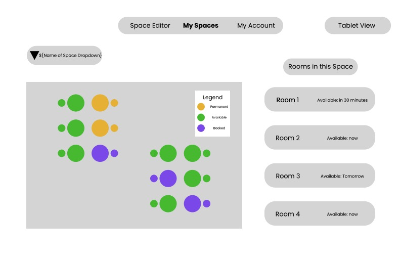

To view the initial prototype in more detail, please have a look here: [Initial Prototype](https://github.com/Space-Saver-Bookings/Space-Saver-Docs/blob/main/docs/wireframes/prototype/Space_Finder_Prototype.pdf)

[Back to contents](#contents)

### Prototyping continued

During our discussions on figuring out the applications features and functionality, a rough prototype more focused on the layout and flow of data of the application was created.

It helped us visualise what exactly we were hoping to achieve with the features and how it works functionally, but also taking into consideration the users experience when navigating around the app.

From this prototype alone, we have decided on a sidebar that acts as the menu navigation, main section which serves the main content of the app and a small header for access to user profile.

[Back to contents](#contents)

### Low fidelity wireframes

In our exploration of conceptualising the visual aspects and user interactions for our application, we embarked on the initial phase of low-fidelity wireframing. During this stage, our primary focus was on creating skeletal representations that outlined the fundamental structure and placement of key elements within the application.

The low-fidelity wireframes served as a rudimentary blueprint, emphasising basic layouts and rough sketches of the user interface. It was instrumental in laying the groundwork for subsequent design decisions, providing a clear visualisation of the spatial arrangement of various components. This phase allowed us to swiftly iterate through design concepts, fostering a collaborative understanding of the application's core structure.

Key considerations during this stage encompassed the placement of essential features, the hierarchy of information, and the overall navigation flow. The simplicity of the low-fidelity wireframes facilitated quick adjustments and refinements, ensuring a solid foundation for the more detailed stages of the design process.

#### Desktop - Sign Up/ Landing Page

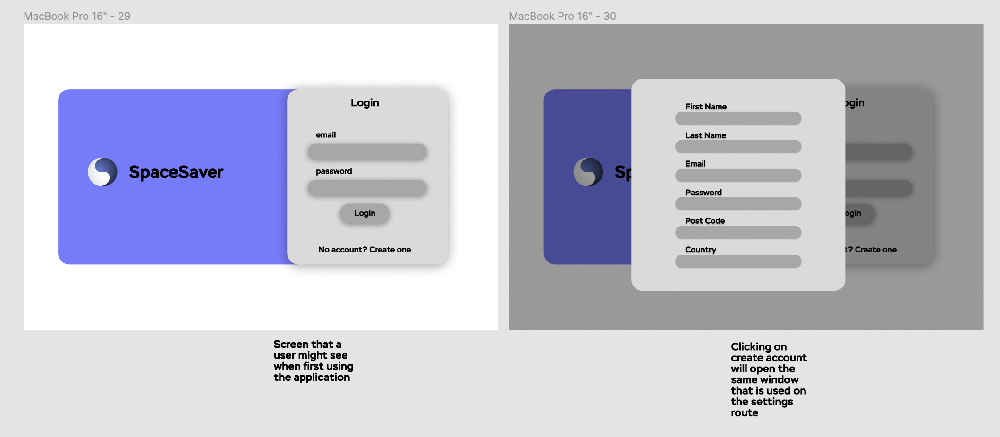

#### Desktop - Home Page

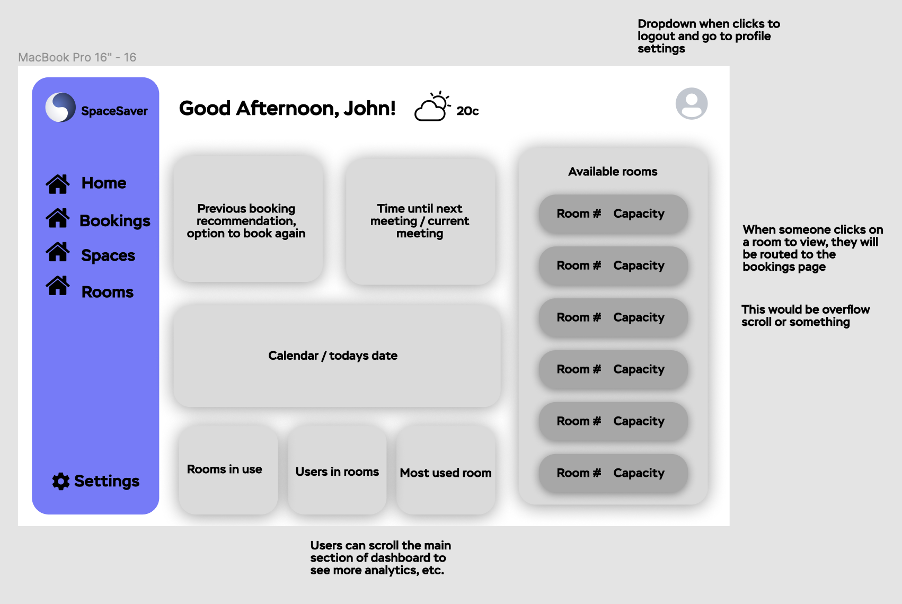

#### Desktop - Spaces Page

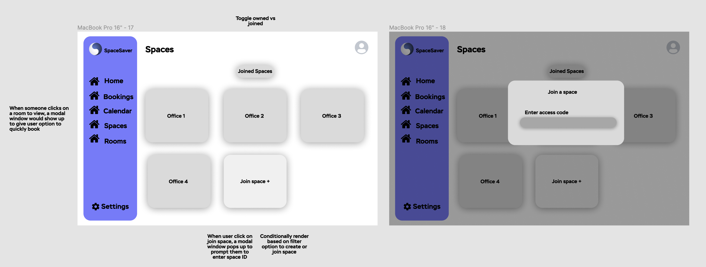

#### Tablet - Home Page

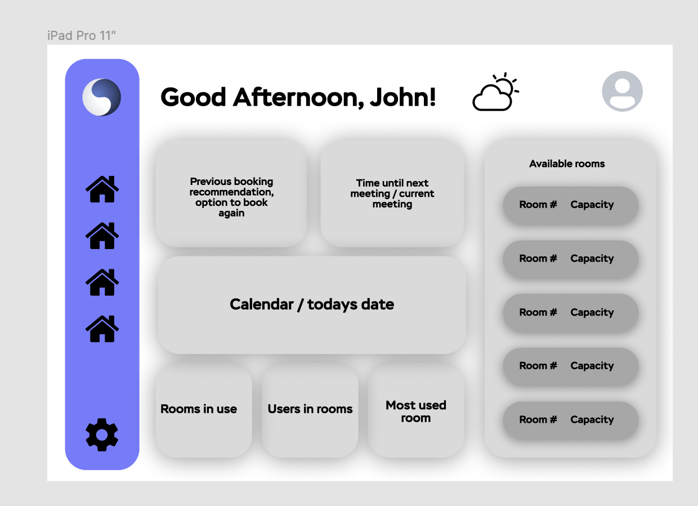

#### Tablet - Bookings Page

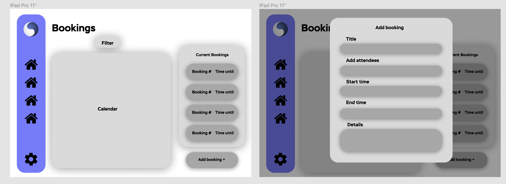

#### Tablet - Individual space page

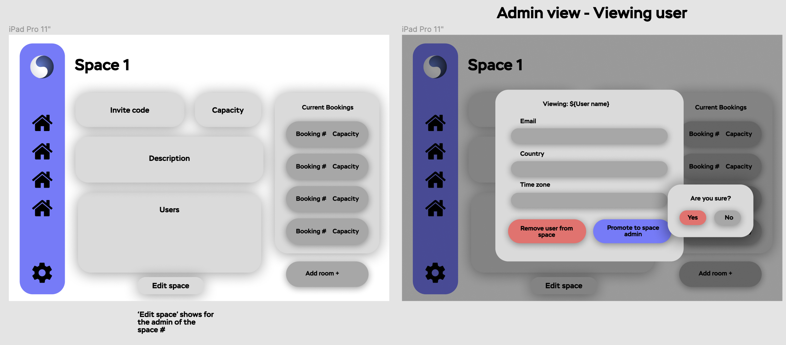

#### Tablet - Individual space page

#### Mobile - Home page

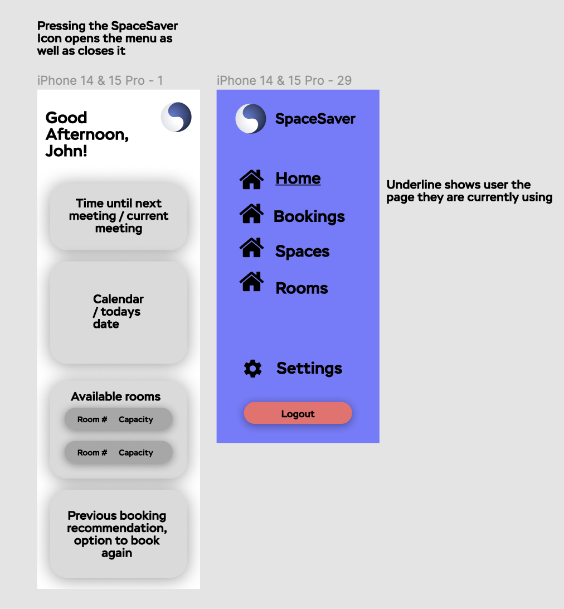

#### Mobile - Bookings page

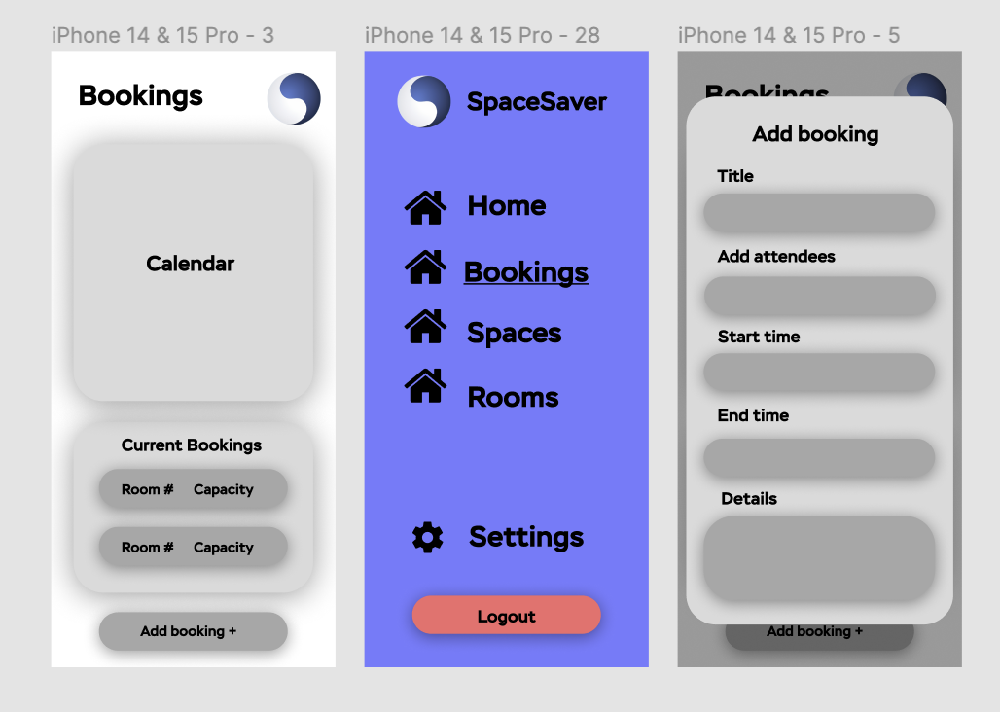

#### Mobile - Rooms page

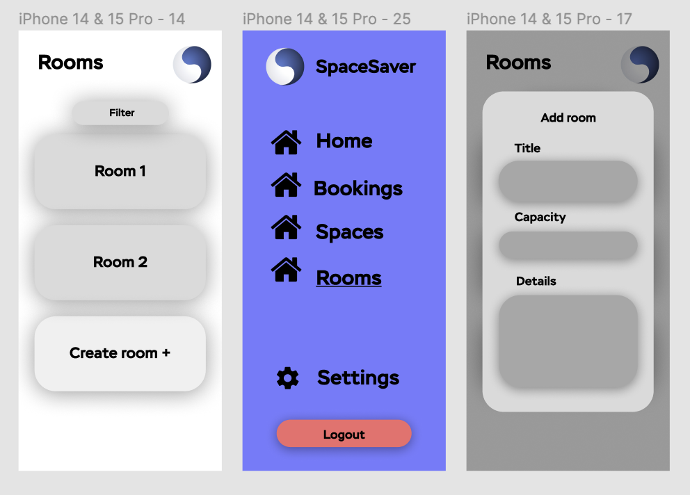

[Back to contents](#contents)

### High fidelity wireframes

Building upon the insights gained from the low-fidelity wireframes, we progressed into the creation of high-fidelity versions that delved into the finer details of the application's visual aesthetics and interactive elements.

The high-fidelity wireframes represented a more polished rendition of the user interface, incorporating refined graphics, precise typography, and realistic representations of interactive elements. This phase aimed to bring the envisioned user experience to life, providing stakeholders with a comprehensive view of the application's final look and feel.

The high-fidelity wireframes served as a pivotal bridge between conceptualisation and implementation, guiding the development team with a clear roadmap for transforming the design vision into a fully functional and aesthetically pleasing application.

<!-- #### Desktop - Home page

 -->

[Back to contents](#contents)

Wireframes can also be viewed in higher definition via Figma: [figma.com/SpaceSaver-High-Fidelity-Wireframe](https://www.figma.com/file/WnAqfuX8gkWsz8wTlGJHOd/SpaceSaver-High-Fidelity-Wireframe?type=design&node-id=0%3A1&mode=design&t=h7h3BL6Y63C0Dryl-1)

### Flow and navigation

[Back to contents](#contents)

---

## Planning methodology

At the outset of our project, we engaged in collaborative discussions, holding meetings to brainstorm ideas for our MERN stack application. During these initial sessions, we familiarised ourselves with each other's working styles and established effective communication practices despite working across different time zones. To streamline our project management, we adopted Trello and structured our workflow into sprints, each spanning a 1-week duration with 3 stand-ups and a review where we discussed topics more in depth or to showcase an idea to each other.

Following the conceptualisation phase, we outlined a preliminary architecture and devised a database plan. Subsequently, we translated our project tasks into a Trello board, categorising them based on requirements and ensuring an equitable distribution of responsibilities among team members, but to also allow each other to have a go at tasks as we saw fit. As we move into development, we will create tasks which will move to reviewed before being marked as completed tasks on Trello and introduce new ones as necessary.

While individual work will be the norm, we anticipate engaging in pair programming sessions using Discord for certain elements of the application.

The development of the app can be segmented into the following phases:

**1. Project Overview:**

-   Define the purpose and scope of the booking application.
-   Identify key features such as user authentication, booking management, and any other relevant functionalities.

**2. Tech Stack:**

-   Choose the MERN stack (MongoDB, Express.js, React, Node.js) for development.

**3. Repository Setup:**

-   Create a new repository for the project on a version control platform like Git (GitHub).
-   Set up the main branch as 'protected' to ensure stability.

**4. Branching Strategy:**

-   Adopt the feature branch method.
-   Create individual branches for each feature or task.
-   Naming convention: `feature/<feature-name>`.

**5. Pull Request Workflow:**

-   Developers work on feature branches.
-   Once a feature is complete, create a pull request to merge it into the main branch.
-   Assign one reviewer to each pull request.

**6. Continuous Integration (CI):**

-   Implement CI tools (Jest, SuperTest) to automate testing and ensure code quality before merging.

**7. Project Structure:**

-   Define the directory structure for the backend (Node.js/Express) and frontend (React) components.

**8. Database Design:**

-   Plan the database schema for storing user data, booking details, etc.
-   Set up MongoDB for data storage.

**9. Authentication:**

-   Implement user authentication using JWT (JSON Web Tokens).

**10. Frontend Development:**

-   Develop the user interface with React components.
-   Implement responsive design for better user experience.

**11. Backend Development:**

-   Set up Express routes for handling booking requests.
-   Connect with MongoDB for data retrieval and storage.

**12. Testing:**

-   Write unit tests and integration tests for both frontend and backend components.

**13. Deployment:**

-   Choose a cloud platform (Heroku) for deployment.
-   Set up a staging environment for testing before production deployment.

**Sprint Topics:**

**Sprint 1: Project Setup and Core Structure**

-   **Repository Setup:**
    -   Create a new repository for the project on a version control platform like Git (GitHub).
    -   Set up the main branch as 'protected' to ensure stability.
-   **Branching Strategy:**
    -   Adopt the feature branch method.
    -   Create individual branches for each feature or task.
    -   Naming convention: `feature/<feature-name>`.
-   **Pull Request Workflow:**
    -   Developers work on feature branches.
    -   Once a feature is complete, create a pull request to merge it into the main branch.
    -   Assign one reviewer to each pull request.
-   **Continuous Integration (CI):**
    -   Implement CI tools (Jest, SuperTest) to automate testing and ensure code quality before merging.

**Sprint 2: Foundational Development**

-   **Project Structure:**
    -   Define the directory structure for the backend (Node.js/Express) and frontend (React) components.
-   **Database Design:**
    -   Plan the database schema for storing user data, booking details, etc.
    -   Set up MongoDB for data storage.
-   **Authentication:**
    -   Implement user authentication using JWT (JSON Web Tokens).

**Sprint 3: Feature Development**

-   **Frontend Development:**
    -   Develop the user interface with React components.
    -   Implement responsive design for a better user experience.
-   **Backend Development:**
    -   Set up Express routes for handling booking requests.
    -   Connect with MongoDB for data retrieval and storage.

**Sprint 4: Testing and Deployment**

-   **Testing:**
    -   Write unit tests and integration tests for both frontend and backend components.
-   **Deployment:**
    -   Choose a cloud platform (Heroku) for deployment.
    -   Set up a staging environment for testing before production deployment.
    -   Deploy the application to a staging environment.
    -   Conduct thorough testing in the staging environment.
    -   Address any issues identified in testing.
    -   Finalise deployment to the production environment.

[Back to contents](#contents)

### Trello Screenshots

Our project approach, utilising Trello, commenced with a basic layout that we later tailored to suit our needs. Initially, we kept it simple, adding columns like 'Notes' and 'Updates' to ensure easy communication and documentation for the entire team.

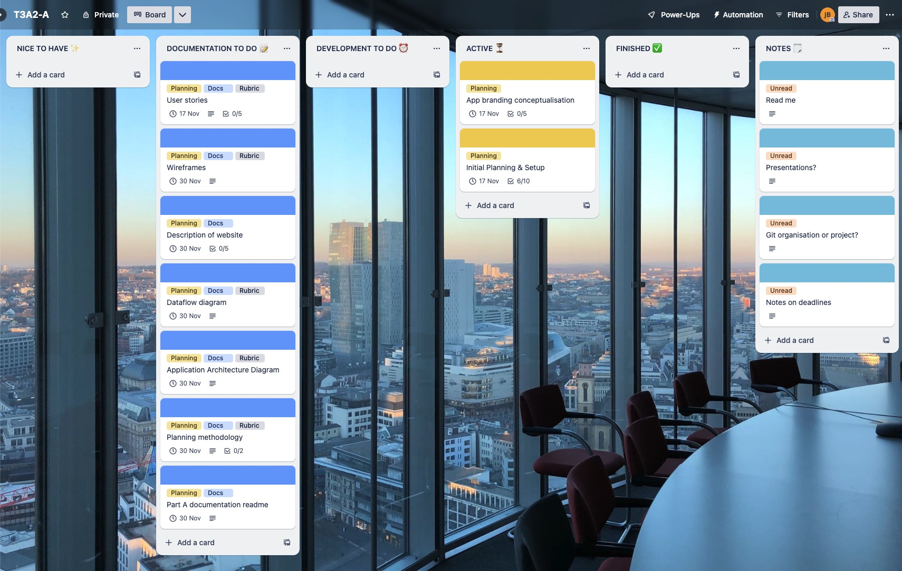

As our project progressed, we embraced agile practices by incorporating specific columns for Sprints, allowing us to plan and execute in focused phases. This adjustment enabled us to adapt quickly to changes and maintain a steady development pace.

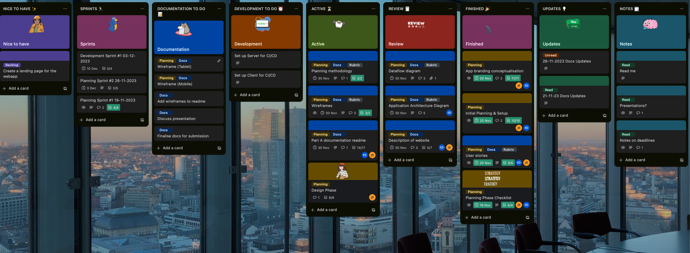

To enhance collaboration and maintain quality, we introduced a 'Review' column. Positioned before the final 'Finished' stage, this step allowed team members to provide constructive feedback, ensuring a thorough evaluation of each other's work. This 'Review' phase became crucial for upholding high standards and sharing knowledge within the team.

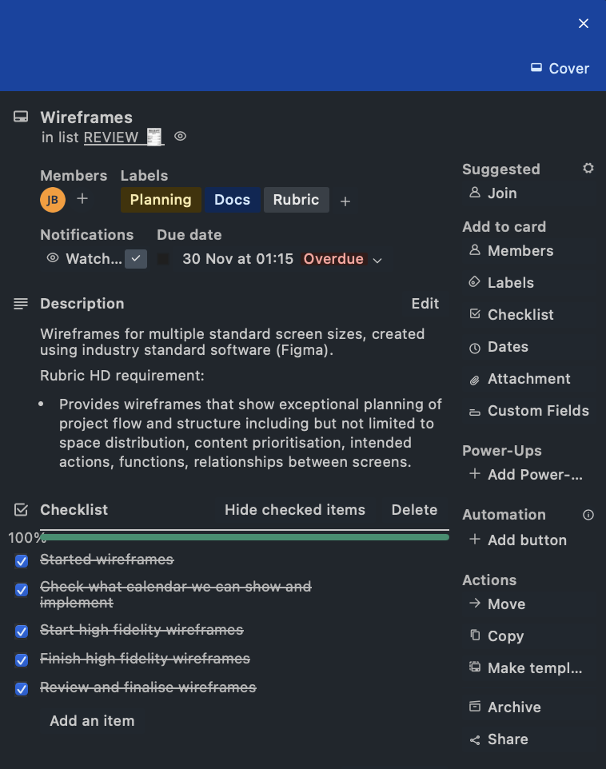

In summary, our Trello-centric approach combined simplicity and efficiency, offering a flexible and collaborative framework. It guided our project seamlessly from start to finish, ensuring precision and excellence in every stage.

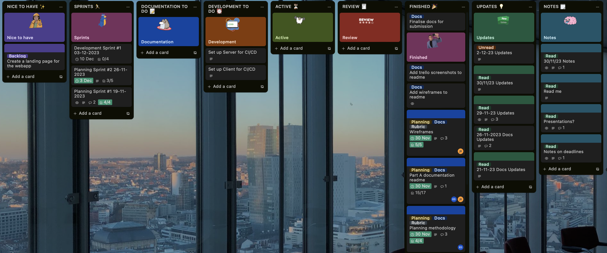

Screenshots of our Trello board can be found organised in date order in the Trello-screenshots directory within this repo.

Please also view the Trello board live here: https://trello.com/b/WOdwJ7cn/t3a2

[Back to contents](#contents)

---
