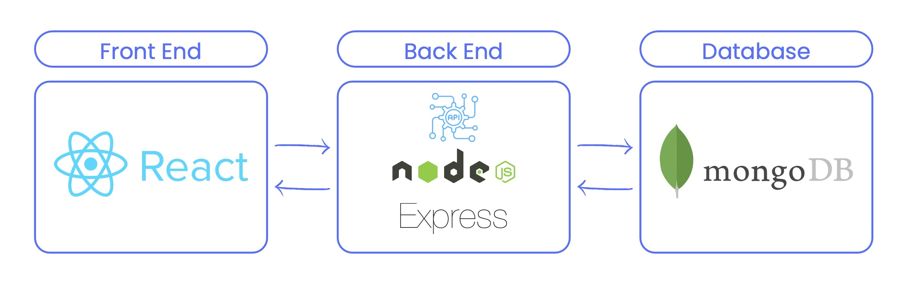

# **Edward Dougherty and Jordan Benjamin T3A2**

---

## **SpaceSaver: MERN full-stack app assignment**

---

### Client:

- Deployed Staging App:
- Deployed Production:

### Server:

- Deployed Staging App:
- Deployed Production:

### Contents

- [Introduction](#introduction)
- [Application Description](#application-description)
  - [Purpose](#purpose)
  - [Features and Functionality ](#features-and-functionality)
  <!-- - [Functionality](#functionality) -->
  - [Target audience](#target-audience)
  - [Tech stack](#tech-stack)
- [Application architecture diagram](#application-architecture-diagram)
- [User stories](#user-stories)
  - [Different iterations](#different-iterations)
  - [Final user stories](#final-user-stories)
- [Wireframes](#wireframes)
  - [Flow and navigation](#flow-and-navigation)
  - [Iterations](#iterations)
- [Planning methodology](#planning-methodology)
  - [Trello screenshots](#trello-screenshots)

---

## Introduction

[Back to contents](#contents)

In Phase A, the focus was on ideation and strategic planning. This encompassed pinpointing a challenge within a local business and formulating a tailored solution to address their needs. The process involved crafting the app's architecture and delineating data flow through comprehensive diagrams, showcasing the structural framework and outlining the information exchange among processes, entities, and data repositories. Additionally, tasks included shaping user personas and crafting corresponding user stories, creating high-fidelity wireframes, and implementing an agile planning approach throughout the developmental stages.

---

## Application Description

[Back to contents](#contents)

Welcome to SpaceSaver, the solution to your space management challenges. Tired of the complexities of juggling multiple platforms for creating, organizing, and accessing spaces? Look no further. SpaceSaver simplifies your experience with a user-friendly sign-up/log-in system, allowing effortless creation and joining of spaces. No more hassle in managing user access or navigating through intricate booking processes. With secure authentication options, intuitive room organisation, and straightforward booking management, SpaceSaver is your all-in-one tool for seamless and efficient space utilisation. Experience a new era of simplicity and control in space management – welcome to SpaceSaver, where we've streamlined the solution for you.

---

## Purpose

[Back to contents](#contents)

The purpose of SpaceSaver, is to provide users with a comprehensive solution for efficient space management. The primary objectives include:

1. **Optimising Workspace Utilisation:** SpaceSaver aims to enhance the effective use of physical spaces within businesses or organisations. By allowing users to create and manage designated spaces, the application facilitates streamlined collaboration and resource allocation.
1. **Solving Local Business Challenges:** The app is designed to address specific challenges faced by local businesses. By identifying and solving these challenges, SpaceSaver contributes to the overall improvement of operational efficiency and productivity.
1. **Enhancing User Experience:** Through features like user-friendly sign-up/log-in, intuitive space creation, and robust user access management, SpaceSaver seeks to provide a positive and seamless experience for its users. The goal is to simplify complex processes associated with space management.
1. **Facilitating Booking Processes:** The application streamlines the booking process for spaces and rooms. Users can create, view, update, and delete bookings, promoting a hassle-free and organised approach to scheduling and utilising available spaces.
1. **Empowering Agile Workflows:** With agile planning integrated into the development process, SpaceSaver aims to adapt to changing requirements efficiently. This ensures that the application remains responsive to user needs and evolving business dynamics.

SpaceSaver serves as a versatile tool that goes beyond traditional space management. It provides a holistic solution for businesses seeking to optimise their physical spaces, enhance collaboration, and improve overall operational efficiency. Whether for small teams or large enterprises, SpaceSaver is crafted to redefine the way users interact with and make the most of their workspaces.

---

## Features and Functionality

[Back to contents](#contents)

### Feature 1 (Sign-up/ Log-in system)

Users can sign up as a regular user. They can create or join a space within the app.

Authentication is internally handled using JWT, involving a straightforward username and password process. The log-in period aligns with the typical workday, spanning 8-12 hours.

Optional feature for Microsoft, Gmail, Apple SSO, or O-Auth logins.

### Feature 2 (Space management)

Users can create a space and share a the ID for others to access. The creator of a space is automatically designated as the admin. Admins have the authority to create and name rooms within the space.

### Feature 3 (User access management)

Admins can view users in their space, with options to read user details and remove users. Admins can assign permissions, with only one admin allowed at a time, triggering a warning when attempting to change.

Optional feature for users to view analytics.

### Feature 4 (Booking Management)

Users can manage bookings, including creation, viewing, updating, and deleting. A calendar overview displays all space bookings, showcasing the user's name and reserved time. There's an overview of available rooms, and both users and admins can update/delete bookings.

Optional feature for notification of booking.

### Feature 5 (Dashboard)

The dashboard serves as the central hub for all users, featuring:

- A sidebar for easy navigation to different app sections: Home, Booking, Spaces, Rooms, Settings.
- The main section comprises the core dashboard content.
- Sub-sections include the user's name, a smaller calendar for accessing the booking space, a quick view of available rooms, and a quick book feature.
- The header displays user profile details.

<!-- *********
TODO Should the below header be removed? We can split the above into this section

### Functionality
 -->

---

## Target audience

[Back to contents](#contents)

---

## Tech stack

[Back to contents](#contents)

**Front-end**: HTML5, CSS3, REACT.JS, Javascript, AXIOS, React Query, Material-ui.

**Back-end**: Node, ExpressJS

**Database**: MongoDB, Mongoose

**Deployment**:
Back-end: <!-- Horoku -->
Front-end: <!-- Netlify -->

**Testing**: <!--  -->

**Project-management tools**: Trello, Discord

**Utilities**: Draw.io, Figma

**DevOps**: Git, Github, VS Code

---

## Dataflow diagram

[Back to contents](#contents)

<!--  -->

---

## Application Architecture Diagram (AAD)

[Back to contents](#contents)

The SpaceSaver app is made up of three components: a front-end, back-end and database.

### Low Level AAD (Development Framework)

### High Level AAD

---

## User stories

[Back to contents](#contents)

In the strategic development of the SpaceSpacer application, the selection of these three personas—Robert, the General Manager; Arlette, the Tech Support Specialist; and Robin, the Sales Lead Generator—was driven by a holistic approach to user-centric design. Robert, as the General Manager, embodies the leadership and decision-making perspective, reflecting the overarching goals of efficient office operations, enhanced team dynamics, and data-driven decision-making. His persona guides the development of features tailored to managerial needs, ensuring SpaceSpacer aligns with high-level organisational objectives.

On the other hand, Arlette and Robin represent distinct user segments within the organisation—Arlette as the tech-savvy full-time employee and Robin as the part-time/casual simplicity seeker. By incorporating these personas, we address the diverse needs and preferences existing within our user base, allowing SpaceSpacer to cater to a broad spectrum of users. Arlette's focus on advanced tech features and Robin's emphasis on simplicity provide valuable insights into creating an app that is not only feature-rich but also adaptable and user-friendly for a wide range of user scenarios, promoting inclusivity and usability throughout the organisation.

### Different iterations

[Back to contents](#contents)

#### Initial

##### User Story - Persona 1: Jack (26) Technical Support Specialist

As Jack, I want an all-in-one system/app for booking spaces, so I can easily check availability and book a room or desk, making my work environment more streamlined and enhancing productivity.

Acceptance Criteria:

- The system/app should provide a clear interface for checking room or desk availabilities.
- Booking a room or desk should be a straightforward process, requiring minimal steps.

Definition of Done:

- The system/app has been developed and thoroughly tested.
- User feedback has been considered and incorporated for improving the user interface.

##### User Story - Persona 2: Jill (37) Senior Software Developer

As Jill, I want a user-friendly booking system with emphasis on UX/UI, so I can quickly find a room for collaborative work with my pair programmer.

Acceptance Criteria:

- The booking system should have an intuitive and visually appealing user interface.
- Jill should be able to find and book a room within a few clicks.

Definition of Done:

- The booking system has been developed and tested for user-friendliness.
- Jill has tested the system and provided feedback, which has been incorporated.
- Documentation includes guidelines for users.

As Jill, I want the ability to add my pair programmer under the same booking, simplifying the collaboration process.

Acceptance Criteria:

- The booking system should allow Jill to easily include her pair programmer when making a booking.

Definition of Done:

- The functionality for adding multiple users under the same booking has been successfully implemented.

##### User Story - Persona 3: Henrietta (29) Marketing Associate

As Henrietta, I want an individual pin-based access for immediate room bookings, allowing me to efficiently book a room if I see it available.

Acceptance Criteria:

- The system should provide a pin-based access feature for immediate room bookings.
- Henrietta should be able to check room availability instantly without logging in

Definition of Done:

- The pin-based access feature is successfully implemented and tested.
- User testing has been completed, and any necessary adjustments have been made.

Employer/Management User Stories

##### User Story - Persona 4: Emily (41) General Manager

As Emily, I want the ability to manage users and their access to spaces.

Acceptance Criteria:

- The booking system should provide functionality for user management and access control.
  Definition of Done:
- User management features are successfully implemented and tested.
- Emily has provided feedback, and necessary adjustments have been made.
- Documentation includes instructions for administrators on user management.

As Emily, I want features for space availability signalling and potentially a built-in chat functionality for improved communication.

Acceptance Criteria:

- The booking system should have features to signal space availability.
- If a chat functionality is implemented, it should provide seamless in-app communication.
  Definition of Done:
- Space availability signalling features are successfully integrated and tested.
- If applicable, the chat functionality is implemented, tested, and user-friendly.
  Documentation includes guidelines for utilising space signalling and chat features.

##### User Story - Persona 5: Aisha (39) Project Manager

As Aisha, I want calendar integration in the current booking system, allowing me to organise my team more efficiently.

Acceptance Criteria:

- The booking system should be integrated with a calendar, providing real-time information about bookings.
  Definition of Done:
- Calendar integration is successfully implemented and tested.
- The system seamlessly syncs with Aisha's calendar for efficient team organisation.
  Documentation includes instructions for utilising the calendar integration.

##### User Story - Persona 6: Muhammad (53) Team Leader

As Muhammad, I want an automated notification system, so my team can receive timely notifications regarding booking information, location, and time.

Acceptance Criteria:

- The booking system should send automated notifications to team members regarding booking details.
  Definition of Done:
- The automated notification system is successfully implemented and tested.
- Notifications are delivered accurately and in a timely manner.
- Documentation includes guidelines for setting up and managing notification preferences.

##### User Story - Persona 7: Deo (28) Team Coordinator

As Deo, I want a user-friendly app for real-time insights into team resource usage, enabling me to make informed decisions and streamline resource allocation.

Acceptance Criteria:

- The app should provide a user-friendly interface for accessing real-time insights into team resource usage.
  Definition of Done:
- The app is successfully developed and tested for user-friendliness.
- Thorough testing ensures accurate and real-time data representation.
- Documentation includes guidelines for utilising the app's features.

#### Combined User Stories

[Back to contents](#contents)

Too many personas led to confusion, so they were combined the personas into 3 main types of users we remade the user stories to suit
Manager Persona

User Story 1:
As the General Manager, I want a comprehensive office space management tool that streamlines the booking process, allowing for increased efficiency and optimal resource allocation. This includes features for space availability signalling and real-time data insights.

User Story 2:
As the General Manager, I need an enhanced booking system with calendar functionality to improve team organisation. This will ensure that team members have clear visibility into booking details, locations, and times, facilitating better communication and coordination.

User Story 3:
As the General Manager, I want an automated notification system within the booking tool to inform team members about booking details. This feature will help in reducing manual communication efforts and enhancing overall team communication.

User Story 4:
As the General Manager, I require a user-friendly app that provides real-time insights into resource usage. This will empower me to make informed decisions for optimal resource allocation and improve overall office operations.

Employee Persona 1: Full-time Tech Enthusiast

User Story 1:
As a Tech Support Specialist, I want an integrated and user-friendly system with advanced tech features for quick space availability checks. This will help me efficiently plan and utilise office spaces based on real-time availability.

User Story 2:
As a Tech Support Specialist, I need a streamlined and tech-efficient booking process to maximise my full-time productivity. This includes features that allow for quick and hassle-free room or desk bookings.

#### Final user stories

[Back to contents](#contents)

##### Manager Persona

**User Story 1:**

- As Robert, the General Manager, I want a comprehensive office space management tool that streamlines the booking process, allowing for increased efficiency and optimal resource allocation. This includes features for space availability signalling and real-time data insights.

**User Story 2:**

- As Robert, the General Manager, I need an enhanced booking system with calendar functionality to improve team organisation. This will ensure that team members have clear visibility into booking details, locations, and times, facilitating better communication and coordination.

**User Story 3:**

As Robert, the General Manager, I require a user-friendly app that provides real-time insights into resource usage. This will empower me to make informed decisions for optimal resource allocation and improve overall office operations.

##### Employee Persona 1: Full-time Tech Enthusiast

**User Story 1:**

As Arlette, the Tech Support Specialist, I want an integrated and user-friendly system with advanced tech features for quick space availability checks. This will help me efficiently plan and utilise office spaces based on real-time availability.

**User Story 2:**

- As Arlette, the Tech Support Specialist, I need a streamlined and tech-efficient booking process to maximise my full-time productivity. This includes features that allow for quick and hassle-free room or desk bookings.

Employee Persona 2: Part-time/Casual

**User Story 1:**

- As Robin, the Sales Lead Generator, I want an intuitive and user-friendly system that allows me to quickly find and book a room for collaborative work during occasional use. This will ensure a seamless experience and enhance my overall workflow.

**User Story 2:**

- As Robin, the Sales Lead Generator, I need enhancements to the existing booking system that prioritise simplicity and user-friendliness for part-time users. This includes features that make it easy to add colleagues to the same booking for occasional collaborative work without complications.

---

## Wireframes

[Back to contents](#contents)

Wireframes can also be viewed in higher definition via Figma: <!-- Link here -->

### Desktop - Sign Up/ Landing Page

[Back to contents](#contents)

<!-- leaving this link here as an example of how we can add it later

 -->

### Flow and navigation

[Back to contents](#contents)

---

### Iterations

[Back to contents](#contents)

---

## Planning methodology

[Back to contents](#contents)

At the start of this project we had a scrum until we came up with a concept that we liked. We then sketched out a rough architecture and database plan, and created a Trello board with tasks that need to be completed in order to finish the docs. Each task was allocated according to skill and fair share of the work.

We will be responsible for marking off the tasks on the Trello as we complete them and adding new tasks as they arise.

We will be working mostly alone, but will pair program some elements using Discord.

The building of the app can be split into the following:

**1. Project Overview:**

- Define the purpose and scope of the booking application.
- Identify key features such as user authentication, booking management, and any other relevant functionalities.

**2. Tech Stack:**

- Choose the MERN stack (MongoDB, Express.js, React, Node.js) for development.

**3. Repository Setup:**

- Create a new repository for the project on a version control platform like Git (GitHub).
- Set up the main branch as 'protected' to ensure stability.

**4. Branching Strategy:**

- Adopt the feature branch method.
- Create individual branches for each feature or task.
- Naming convention: `feature/<feature-name>`.

**5. Pull Request Workflow:**

- Developers work on feature branches.
- Once a feature is complete, create a pull request to merge it into the main branch.
- Assign one reviewer to each pull request.

**6. Continuous Integration (CI):**

- Implement CI tools (Jest, SuperTest) to automate testing and ensure code quality before merging.

**7. Project Structure:**

- Define the directory structure for the backend (Node.js/Express) and frontend (React) components.

**8. Database Design:**

- Plan the database schema for storing user data, booking details, etc.
- Set up MongoDB for data storage.

**9. Authentication:**

- Implement user authentication using JWT (JSON Web Tokens).

**10. Frontend Development:**

- Develop the user interface with React components.
- Implement responsive design for better user experience.

**11. Backend Development:**

- Set up Express routes for handling booking requests.
- Connect with MongoDB for data retrieval and storage.

**12. Testing:**

- Write unit tests and integration tests for both frontend and backend components.

**13. Deployment:**

- Choose a cloud platform (Heroku) for deployment.
- Set up a staging environment for testing before production deployment.

**Sprint Topics:**

**Sprint 1:**

- Set up project repository and branching structure.
- Implement user authentication.

**Sprint 2:**

- Develop the booking management system on the backend.
- Begin frontend development for booking features.

**Sprint 3:**

- Complete frontend development.
- Integrate frontend with backend services.

**Sprint 4:**

- Implement testing and continuous integration.
- Prepare for deployment.

**Sprint 5:**

- Deploy the application to a staging environment.
- Conduct thorough testing in the staging environment.

**Sprint 6:**

- Address any issues identified in testing.
- Finalise deployment to the production environment.

### Trello Screenshots

[Back to contents](#contents)

Screenshots of our Trello board can be found organised in date order in the Trello-screenshots directory within this repo.
Please also view the Trello board live here: https://trello.com/b/WOdwJ7cn/t3a2

---
